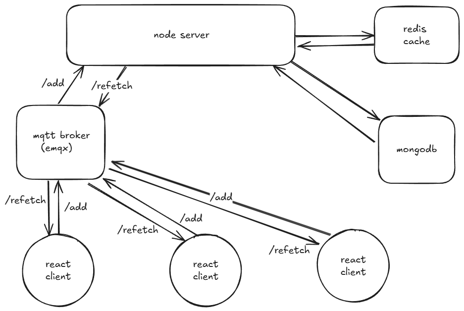

# fullstack_task_raunak


  
  
API  
/fetchAllTasks - GET - retrieves all tasks  
/deleteAllTasks - GET - deletes all tasks  
  
   
```
cd client
npm install
npm run dev
```
  
```
cd server
npm install
npm run start
```
